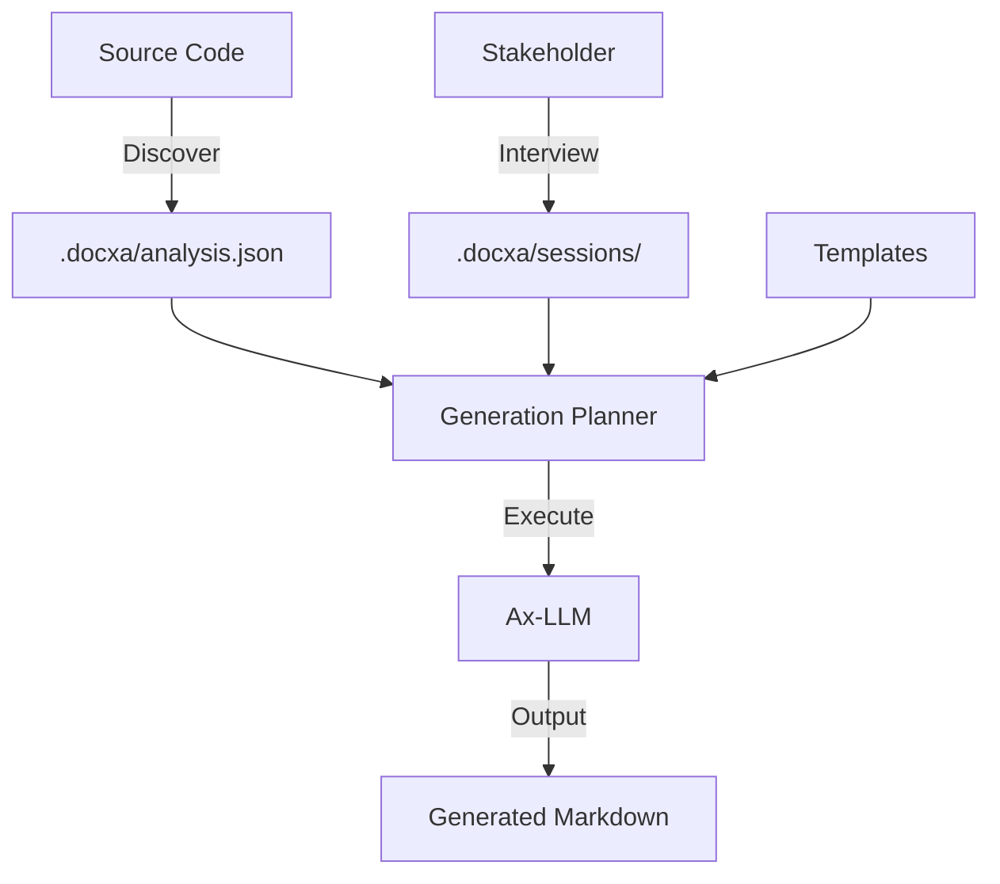

# Architecture

Docxa is built with a modular, extensible architecture designed for high-fidelity documentation generation.

## Component Overview

- **Core Engine**: Manages the workspace state, document graph, and template library.
- **Agents**: Specialized AI personas (PM, Architect, Developer) driven by Ax-LLM.
- **Analysis Layer**: Pluggable framework detectors and repository scanners.
- **Interview Engine**: Handles role-aware conversations and persists session state.
- **Generation Planner**: The "Brain" that evaluates if enough evidence exists to safely generate a document.

## Data Flow

## State Management

Docxa maintains all its state in a local `.docxa/` directory within your project. This includes analysis metadata, active interview sessions, and cached AI responses. This directory should typically be ignored by your version control system.
